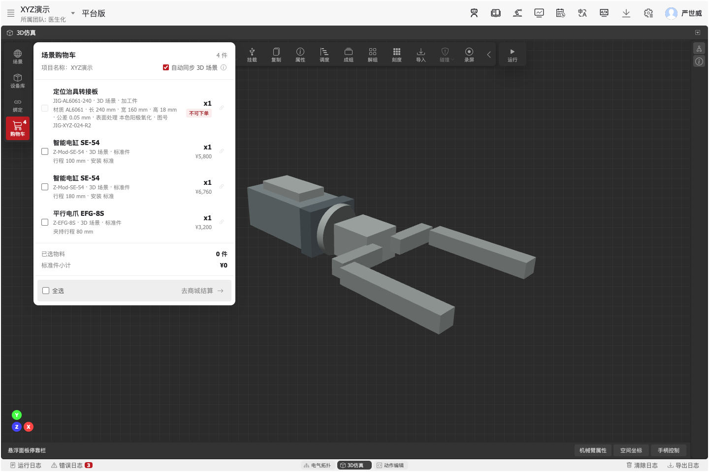
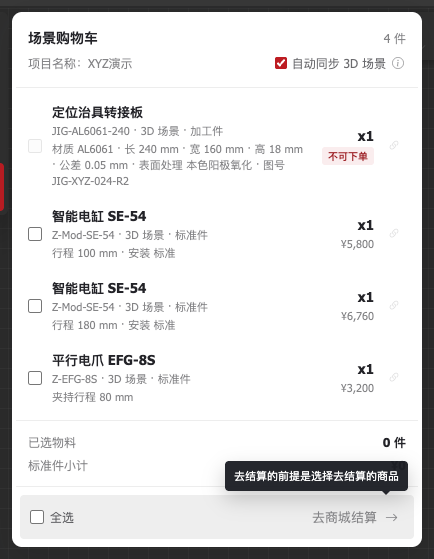
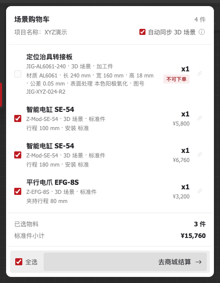
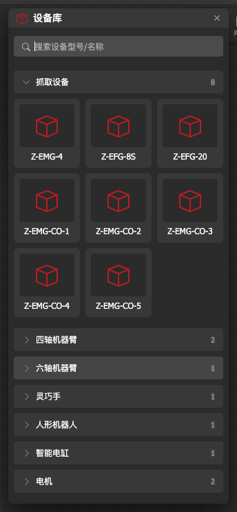
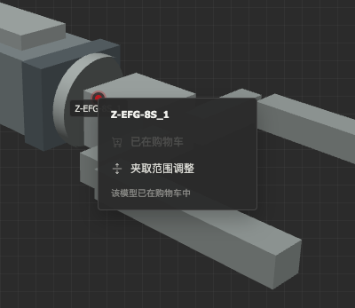
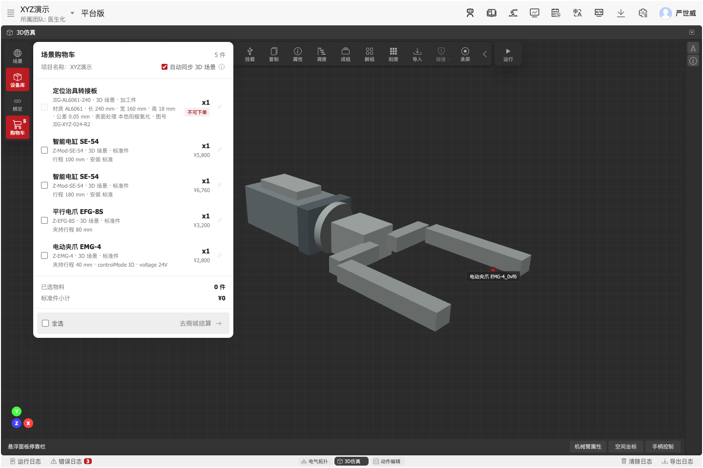
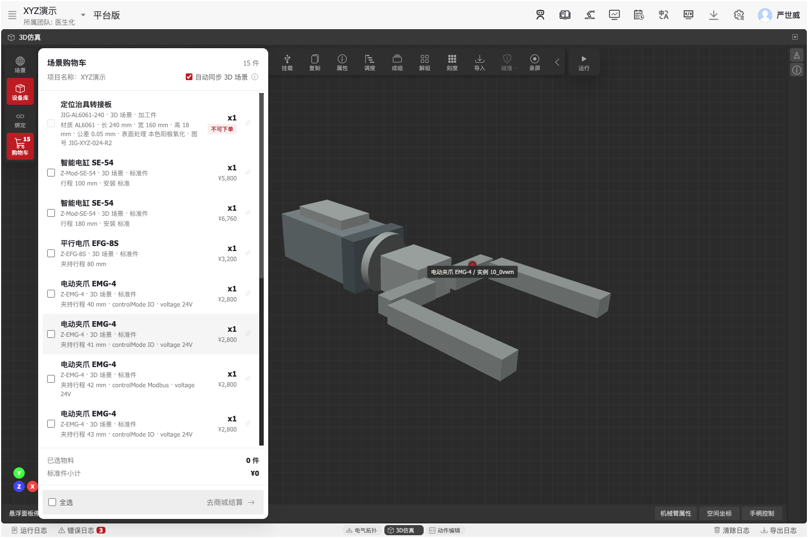

# HitbotOS UI - 仿真面板

基于纯HTML/CSS/JavaScript的3D仿真系统用户界面，提供多窗口布局管理、电气拓扑编辑、动作编辑、设备库浏览、购物车结算衔接等功能。

## 项目特性

- **动作编辑器**：Blockly/Flow 编程，真机/仿真/孪生运行目标
- **多窗口布局管理**：支持多种预设布局和自定义窗口排列
- **3D仿真编辑器**：完整的工具栏、场景管理、设备库等功能
- **设备库面板**：可拖动的浮动面板，支持设备浏览、搜索和拖拽添加
- **购物车衔接**：支持 3D 场景实例级物料同步、参数化计价、结算选择和商城数据交接
- **电气拓扑编辑**：可视化电气连接关系编辑，3D 拾取绑定
- **响应式设计**：自适应不同屏幕尺寸和布局模式

## 文件结构

```
/
├── index.html                    # 主入口
├── css/                         # 样式目录
│   ├── main.css                 # 主样式
│   ├── cart.css                 # 3D 场景购物车入口、宽幅悬浮窗和结算选择样式
│   ├── window.css               # 窗口样式
│   ├── simulator-toolbar.css    # 工具栏样式
│   ├── panel-tabs.css           # 面板标签样式
│   ├── panel-ui-components.css  # 面板 UI 组件样式
│   └── binding-panel.css        # 绑定弹窗样式
├── js/                          # 脚本目录
│   ├── script.js                # 核心功能脚本
│   ├── cart.js                  # 场景实例同步、参数计价、购物车状态和商城交接逻辑
│   ├── layout-manager.js        # 布局管理器
│   ├── panel-loader.js          # 面板加载器
│   └── binding-panel.js         # 3D 场景绑定弹窗逻辑
├── panel-tabs-content.html      # 面板内容
└── docs/                        # 文档目录
```

## 版本历史

### v1.5.0 - 3D 场景购物车交互重构 (2026-08-02)

本版本依据购物车交互评审结论，重新明确设备库、3D 场景、购物车与商城结算之间的职责边界。

**新增与改进内容**：

- **入口回归 3D 场景**：移除全局顶部购物车，购物车只在 3D 仿真左侧工具栏出现，避免与电气拓扑等模块产生错误关联
- **设备库职责收敛**：设备库不再直接加入购物车，只作为模型浏览与拖入 3D 场景的来源
- **实例级场景同步**：购物车按具体场景实例、商品型号和参数配置同步；同型号不同参数分别成行、分别计价
- **自动与手动同步**：自动同步默认开启，场景新增、参数变化和对象删除会同步更新购物车；关闭后可通过场景实例右键手动加入
- **物料类型规则**：标准件、定制件和加工件可进入购物车，纯参考模型不进入采购流程
- **加工件示例**：加入“定位治具转接板”模拟数据，完整展示材质、尺寸、公差、表面处理和图号，并标记为“不可下单”
- **完整参数展示**：购物车宽度由 328px 增至 410px（约增加 25%）；参数不再限制前三项，超出单行时自动换行显示
- **高度自适应**：商品少时浮层按内容自然收缩；商品多时使用从 3D 工具栏顶部到状态栏上方的全部可用高度，仅商品列表滚动，标题、汇总和结算区保持可见
- **结算选择门槛**：每行商品和底部全选均默认不勾选；至少选择一件可下单商品后才启用“去商城结算”，禁用时悬停显示原因
- **商城数据交接**：结算时生成包含企业、项目、场景实例、商品、参数、数量和价格的 `handoff` 数据，并通过 URL 参数交给商城
- **分栏浮层适配**：购物车仍由 3D 工具栏触发，但使用页面级浮层呈现；顶部与 3D 左侧工具栏对齐，并避免在窄分栏中被窗口边界裁切

#### 更新截图

下列图片统一在 [`http://localhost:5501/?layout=fs_sim`](http://localhost:5501/?layout=fs_sim) 全屏 3D 仿真布局下采集，均可点击或右键打开图片链接查看原图。

| 更新点 | 截图 | 说明 |
| --- | --- | --- |
| 3D 场景专属入口与全局效果 | [](docs/assets/cart-v1.5.0/01-cart-overview.png) | 购物车入口位于 3D 左侧工具栏，浮层顶部与工具栏对齐，并可跨分栏完整显示。 |
| 完整参数与结算门槛 | [](docs/assets/cart-v1.5.0/02-cart-parameters-and-guard.png) | 加工件展示全部参数并标记不可下单；未选择商品时，悬停结算区会解释前置条件。 |
| 全选与可结算状态 | [](docs/assets/cart-v1.5.0/03-cart-selected-checkout.png) | 全选只选择三件可下单标准件，加工件保持禁用；同步计算 3 件与 ¥15,760 小计。 |
| 设备库作为拖拽来源 | [](docs/assets/cart-v1.5.0/04-device-library-drag-source.png) | 设备卡片保留浏览和拖入场景能力，不再出现直接加入购物车按钮。 |
| 场景实例右键菜单 | [](docs/assets/cart-v1.5.0/05-scene-instance-context-menu.png) | 右键具体场景实例查看加入状态；自动同步开启时明确显示“已在购物车”。 |
| 拖入场景后自动同步 | [](docs/assets/cart-v1.5.0/06-scene-drop-auto-sync.png) | 模拟拖入电动夹爪后，场景生成新实例，购物车徽标增至 5，并同步显示该实例的参数和价格。 |
| 大量商品时自适应高度 | [](docs/assets/cart-v1.5.0/07-cart-adaptive-height.png) | 15 行不同配置全部进入列表；浮层使用到状态栏上方，仅中间商品区滚动，顶部同步信息和底部结算区持续可见。 |

### v1.4.1 - OS 购物车与商城结算衔接 (2026-06-25)

**新增与改进内容**：

- **顶部购物车入口**：在顶部右侧新增购物车入口，支持物料数量徽标和悬浮窗预览
- **设备库加入购物车**：设备卡片支持直接加入购物车，并与商城标准件型号建立映射
- **方案设备自动同步**：支持自动同步仿真或电气架构界面里已使用的可采购设备
- **同步前清单确认**：开启自动同步时，如购物车未补齐方案设备，会展示待同步清单，支持同步全部或选择同步
- **购物车物料管理**：支持移除物料；若设备仍在方案中使用，会先展示确认提示
- **商城结算衔接**：购物车悬浮窗保留去商城结算入口，将 OS 项目购物车数据交给商城结算流程

### v1.4.0 - 3D 仿真体验与界面系统升级 (2026-05-25)

**新增与改进内容**：

本版本整合了 v1.3.1 之后的 3D 仿真交互、机械臂操作、工具栏与整体界面体验优化。

- **3D 仿真场景增强**：提升场景展示与交互体验，支持更自然的视角操作和对象定位
- **机械臂操作面板**：新增机械臂相关操作入口，便于查看和调整关键参数
- **夹爪范围调整**：支持查看、编辑和拖拽调整夹爪范围，提升调试效率
- **场景快捷操作**：在 3D 场景中增加快捷菜单，减少常用操作路径
- **视口工具栏优化**：工具栏支持收起与展开，执行控制更加集中，画布空间利用更高
- **界面视觉统一**：统一浮动面板、工具栏、按钮和弹层的视觉风格
- **面板层级优化**：优化浮动面板的阴影、间距和层级关系，减少视觉干扰
- **绑定流程细节优化**：进一步优化绑定方案选择和切换体验，使操作上下文更清晰

### v1.3.1 - 绑定方案选择流程 (2026-05-09)

**改进内容**：

优化 3D 场景与绑定方案的绑定流程，避免用户在未明确方案上下文时直接绑定设备。

- **绑定前置方案选择**：绑定弹窗顶部新增“绑定方案”下拉框，需先选择方案后才展示拓扑模型绑定内容
- **绑定内容门槛控制**：未选择方案时展示空状态提示，选择后加载拓扑模型列表、绑定详情与 3D 拾取操作
- **方案切换预警**：当前方案已有绑定关系时，切换方案会弹出二次确认，确认后清空已有绑定并切换到新方案
- **交互细节优化**：调整下拉框箭头位置与占位文案，保持方案选择区始终位于绑定内容上方

### v1.3.0 - 动作编辑器 (2026-04-28)

**新增内容**：

1. **动作编辑器**：优化运行交互，支持 Blockly/Flow 编程方式与真机/仿真/孪生运行目标
   - 编程方式：Blockly（块编程，实时生成 Python）、Flow（流程图编程）
   - 运行目标：真机执行、仿真运行、真机+仿真孪生同步

2. **机械臂属性面板**：三种视觉风格，浮动多面板系统
   - 仪表盘风格（Instrument Dashboard）
   - 坐标舱风格（Space Coordinate Cabin）
   - 游戏手柄风格（Gamepad Controller）
   - 支持多面板同时显示，独立定位

3. **绑定面板**：电气拓扑绑定配置
   - 通讯和控制配置
   - 支持 3D 拾取模式，拾取时面板自动隐藏

4. **设备库悬浮弹窗**：悬停查看设备参数
   - 悬停 500ms 延迟显示设备参数详情
   - 边界感知定位，自动调整显示位置

### v1.2.1 - 界面调整 (2026-03-07)

**调整内容**：

优化工具栏按钮布局，提升界面简洁度。

- **录屏按钮位置调整**：从左侧工具栏移动到子工具栏（3D视口工具栏）最右侧
- **左侧工具栏精简**：保留场景、设备库、绑定（"工具"按钮仅在窄屏模式下显示用于切换子工具栏）
- **子工具栏完善**：录屏功能与测量、对齐等编辑工具集中在同一工具栏

### v1.2.0 - 设备库面板 (2026-03-07)

**新增内容**：

添加可拖动的设备库侧边栏面板，支持设备浏览和场景添加。

#### 面板特性

- **浮动面板**：可拖动的独立面板，不影响其他窗口布局
- **智能定位**：面板顶部与设备库按钮对齐，高度自适应剩余画布空间
- **分类管理**：支持7个设备分类（抓取设备、四轴机器臂、六轴机器臂、灵巧手、人形机器人、智能电缸、电机）
- **搜索功能**：实时搜索设备型号和分类名称
- **三列布局**：设备卡片采用三列网格布局，紧凑高效
- **设备拖拽**：支持拖拽设备卡片到3D场景中添加设备
- **选中状态**：点击设备卡片显示选中高亮效果

#### 面板规格

- 面板宽度：320px
- 面板高度：自适应（从按钮顶部到状态栏顶部）
- 设备卡片：3列网格布局，图标最大化显示
- 分类状态：默认全部收起，点击展开/收起

#### 交互优化

- 搜索图标内嵌在输入框中
- 关闭按钮紧贴右侧边缘
- 悬停时图标变亮，无背景色变化
- 水平边距与设备列表保持一致

### v1.1.0 - 工具栏响应式升级 (2026-03-07)

**改进内容**：

优化3D仿真面板工具栏的交互体验，根据画布可用空间智能调整显示模式。

#### 大屏幕模式（画布宽度 ≥ 650px）

- 子工具栏常驻显示在画布顶部居中位置
- 隐藏"工具"切换开关
- 所有工具按钮（测量、对齐、挂载、复制、属性、调度、成组、解组、刻度、导入、碰撞等）直接可见
- 提升操作效率，减少点击次数

#### 小屏幕模式（画布宽度 < 650px）

- 在左侧主工具栏显示"工具"切换按钮
- 子工具栏默认隐藏，节省画布空间
- 点击"工具"按钮展开/收起子工具栏
- 子工具栏展开后位于左侧，不影响画布中心区域

#### 适用场景

- 全屏3D仿真时，工具栏自动居中显示
- 多窗口分屏布局时，工具栏根据实际可用空间调整
- 窗口大小动态调整时，工具栏模式实时响应

### v1.0.0 - 初始版本

- 基础多窗口布局系统
- 3D仿真面板基本功能
- 工具栏点击展开/收起交互

## 开发预览

```bash
# 直接在浏览器中打开
open index.html

# 或使用本地服务器（项目约定端口 5501）
python3 -m http.server 5501
```

## 浏览器兼容性

- Chrome/Edge 90+
- Firefox 88+
- Safari 14+

## 许可证

版权所有 (c) 2026 HitbotOS
