# HitbotOS · 3D 场景程序编排

本版本把“看场景、选设备、编程序、调变量、看运行状态”收拢到同一个 3D 仿真工作区。用户不需要离开当前场景，就能围绕选中的机器人或末端设备组织函数、添加指令并修改参数。

## v1.6.0 · 场景程序与全局变量

### 从场景对象进入程序

程序面板放在右侧边栏，与“结构”和“属性”使用同一套对象上下文：在场景中选中机器人、夹爪或其他可编程设备后，右侧标题会同步显示当前对象，程序内容也始终对应这个对象。

这样的布局让“选中对象 → 看属性 → 编程序”成为连续动作，也避免再出现一块与对象选择脱节的独立浮窗。右侧边栏可以从左边缘拖动调整宽度，较长的函数名、变量名和参数值也能完整查看。

[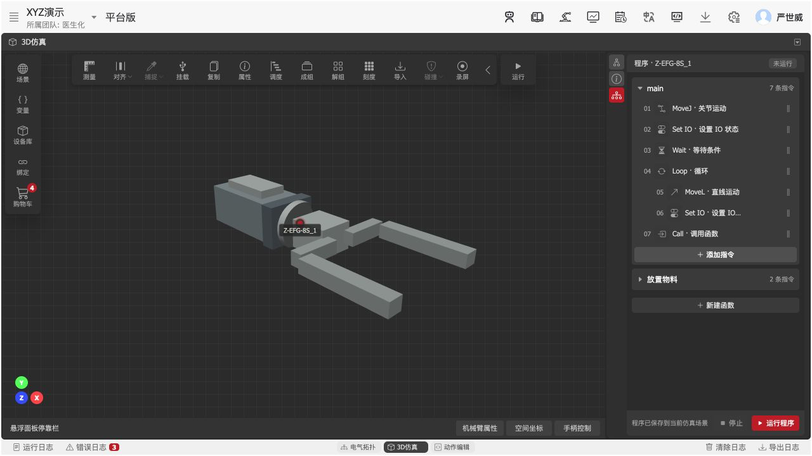](docs/assets/program-v1.6.0/00-object-context-program.png)

### 全局变量在左，设备程序在右

全局变量属于整个仿真场景，不属于某一个被选中的设备，因此入口放在 3D 场景左侧。程序则属于当前对象，放在右侧对象边栏。两块面板可以同时打开，用户一边配置某台设备的程序，一边核对跨设备共享的变量状态。

[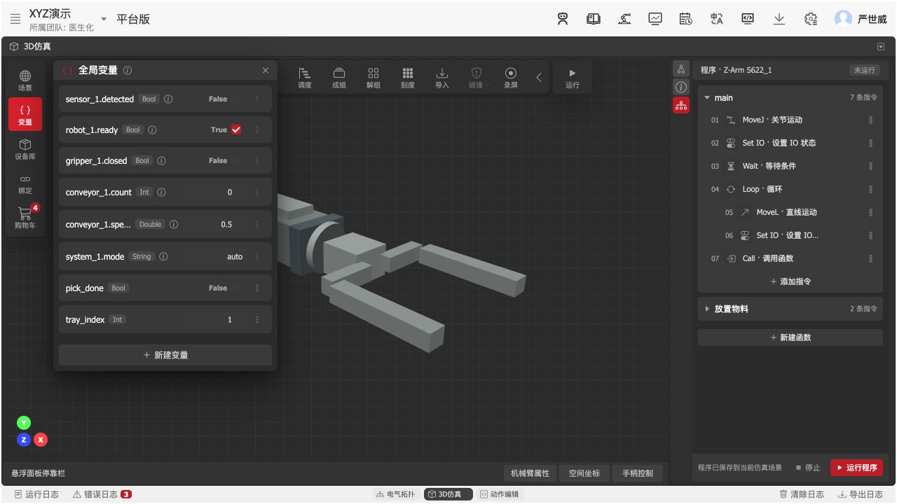](docs/assets/program-v1.6.0/01-variables-and-program-layout.png)

## 全局变量

### 两类变量，各自承担不同职责

| 变量类别 | 适用场景 | 可以调整的内容 | 保护规则 |
| --- | --- | --- | --- |
| 系统变量 | 传感器结果、机器人就绪状态、夹爪状态、计数、速度和运行模式 | 仿真时可临时修改当前值，用来验证等待条件和协同逻辑 | 名称、类型和来源由设备决定，不允许改名或删除 |
| 用户变量 | 工艺步骤标记、托盘序号、跨设备协同信号 | 名称、类型、当前值均可编辑 | 被指令引用时不能直接删除，先处理引用关系 |

每一条系统变量都带有来源说明入口。来源信息平时收起，避免列表过宽；需要核对时再查看它由哪个传感器、机器人或 IO 映射生成。

### 支持四种变量类型

- `Bool`：开关、到位、完成等二值状态。
- `Int`：数量、序号、循环计数等整数。
- `Double`：速度、距离、工艺参数等小数。
- `String`：模式名称、批次标识等文本。

新建变量时，名称、类型和初始值在同一处完成；切换类型后，值输入方式会同步变化，减少格式错误。

[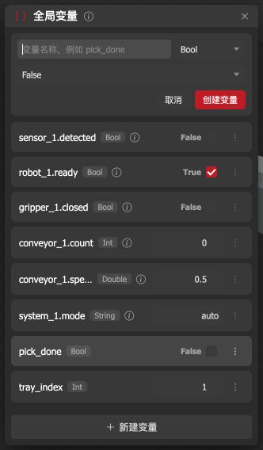](docs/assets/program-v1.6.0/02-variable-create-types.png)

### 用户变量可以随时维护

用户变量的更多操作默认收在行尾菜单中，保持列表紧凑。进入编辑后可以同时修改名称、类型和值；取消和保存都留在当前行，不打断场景工作。

[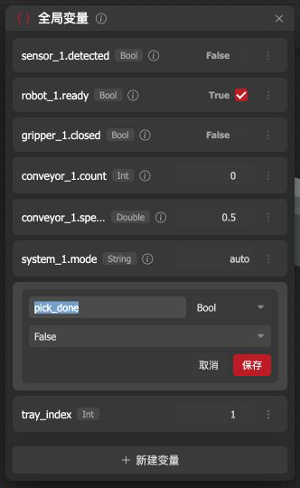](docs/assets/program-v1.6.0/03-variable-edit.png)

## 程序面板

### 用函数组织一台设备的动作

每个函数是一段可复用的动作。函数采用手风琴结构，一次只展开当前正在处理的函数，标题右侧直接显示指令数量；其他函数保持折叠，便于在有限的右侧空间中快速切换。

属性编辑区嵌在所选指令所属函数的底部，而不是脱离函数另开窗口。用户始终能看见“这条属性属于哪一个函数、哪一条指令”。属性区底边可以拖动调整高度，右侧边栏本身也可以调整宽度。

### 新建函数

“新建函数”始终位于函数列表末尾。点击后直接在原位置输入名称，创建成功后自动展开新函数，并用空状态提示从“添加指令”开始。空名称和重名会就近说明原因。

[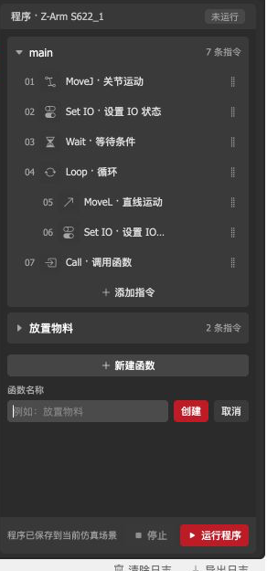](docs/assets/program-v1.6.0/04-function-create.png)

### 修改函数名称

函数标题旁的编辑入口在需要时出现。重命名采用行内编辑：按 Enter 或移开焦点保存，按 Esc 取消，不需要跳转页面。

[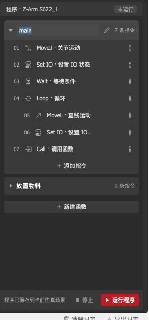](docs/assets/program-v1.6.0/05-function-rename.png)

## 指令编排

### 从当前函数末尾添加指令

每个函数自己的“添加指令”位于该函数最后一条指令之后。菜单标题会明确显示目标函数，新指令添加后自动成为当前选中项，并立即展开对应属性。

[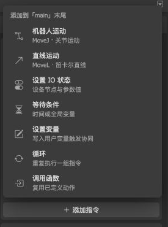](docs/assets/program-v1.6.0/06-instruction-types-menu.png)

本版提供七类指令：

| 指令 | 用途 | 主要属性 |
| --- | --- | --- |
| MoveJ · 关节运动 | 以关节运动方式到达目标点 | 目标点、速度、加速度、平滑度 |
| MoveL · 直线运动 | 以笛卡尔直线方式到达目标点 | 目标点、速度、加速度、平滑度 |
| Set IO · 设置 IO 状态 | 改变夹爪、传送带或气缸节点状态 | 设备、节点、参数类型、参数值 |
| Wait · 等待条件 | 等待固定时间或等待全局变量满足条件 | 等待类型、最长等待、变量、判断条件、期望值 |
| Set · 设置变量 | 写入用户变量，向其他设备发出协同信号 | 目标变量、写入值 |
| Loop · 循环 | 描述一组动作的重复次数 | 循环次数 |
| Call · 调用函数 | 复用另一个已定义函数 | 目标函数 |

### 调整、编辑和删除指令

- 拖动指令行末尾的把手可以调整同一函数内的执行顺序，插入线会提示落点。
- 点击指令后，在所属函数底部编辑它的属性；修改后列表状态和保存提示同步更新。
- 删除入口只在当前操作行出现，减少误触。
- 删除后提供短时“撤销”，可以原位恢复刚才的指令和顺序。

[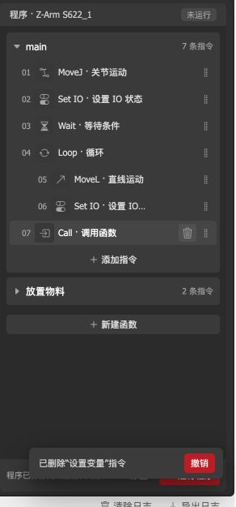](docs/assets/program-v1.6.0/11-delete-undo.png)

## 指令属性设计

### 机器人运动

MoveJ 与 MoveL 共用稳定的参数顺序：先选择目标点，再设置速度、加速度和平滑度。“运动到此”只移动仿真模型，用来确认目标位置，不会启动整段程序。

[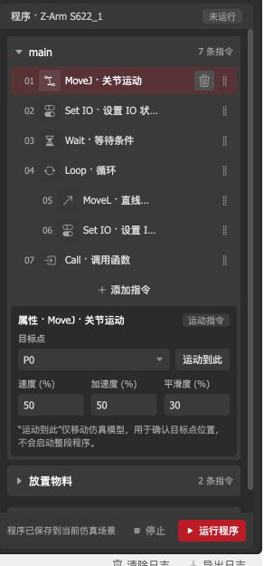](docs/assets/program-v1.6.0/07-motion-properties.png)

### 设置 IO 状态

IO 属性延续设备现场的阅读顺序：设备选择、节点选择、参数类型、参数值。设备名称前的状态点用于快速确认在线状态，说明文字则明确这条指令执行时会写入哪个节点。

[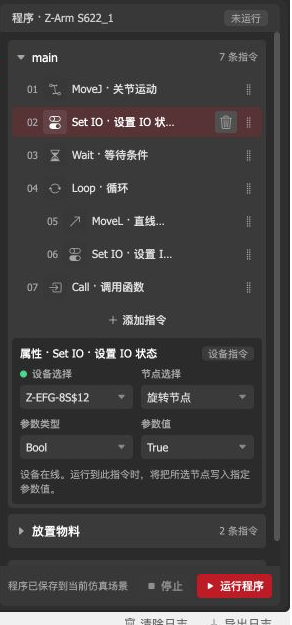](docs/assets/program-v1.6.0/08-io-properties.png)

### 等待全局变量

等待指令既可以使用固定时间，也可以监听全局变量。选择变量后，判断条件和期望值会跟随变量类型变化；数值变量可使用大于、小于等条件，Bool 变量保持简单的真假判断。

[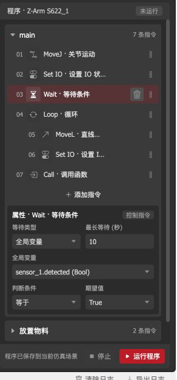](docs/assets/program-v1.6.0/09-wait-variable-condition.png)

### 设置用户变量

“设置变量”只允许写入用户变量，避免程序覆盖由设备产生的系统状态。它与另一台设备的“等待条件”配合，可以表达“夹取完成后启动传送带”之类的跨设备协同。

[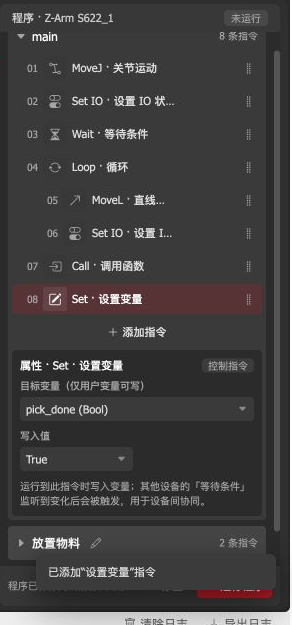](docs/assets/program-v1.6.0/10-set-variable-instruction.png)

### 循环

循环指令设置重复次数，缩进的后续指令表示循环范围。首版先验证一级循环的层级表达和属性密度。

[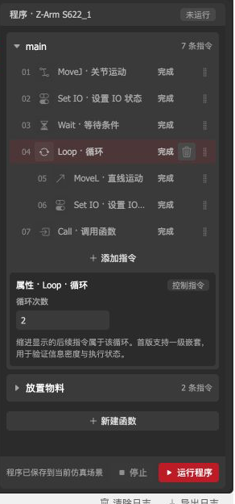](docs/assets/program-v1.6.0/13-loop-properties.png)

### 调用函数

调用指令从其他已定义函数中选择目标函数，避免当前函数调用自己。它用于把“回零”“取料”“放置”等通用动作复用到主流程。

[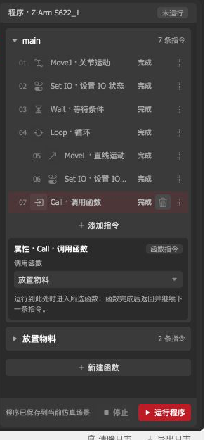](docs/assets/program-v1.6.0/14-call-function-properties.png)

## 运行与状态反馈

程序面板底部保留停止和运行两个持续可见的动作。运行后：

- 面板标题显示未运行、运行中、等待中或已暂停。
- 当前指令在列表中高亮，并显示“执行中”或“等待”。
- 已完成指令保留完成状态，便于回看执行进度。
- 运行按钮切换为暂停，暂停后可以继续；停止后保留当前仿真位置。
- 运行结束时按本次实际指令数量反馈结果。

[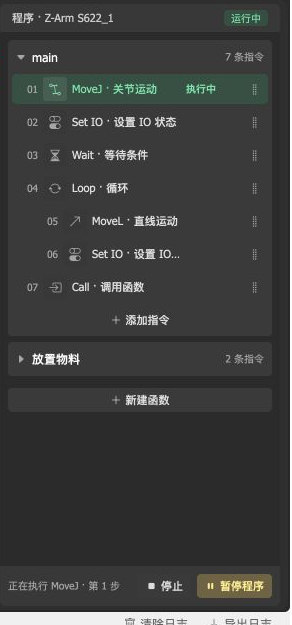](docs/assets/program-v1.6.0/12-run-state.png)

## 首版验证边界

当前版本重点验证场景对象上下文、函数与指令的信息组织、属性编辑、全局变量协同和逐条运行反馈。循环范围与调用函数已经具备清晰的配置方式；真实运行时对循环次数的展开、进入被调用函数并返回主流程，仍是下一阶段需要接入的执行能力。

## 既有场景能力

- 3D 场景设备浏览、拖入、选择与属性查看。
- 多窗口布局以及全屏 3D 仿真。
- 设备库、绑定、购物车与商城结算衔接。
- 动作编辑、运行日志与错误日志。
- 机械臂属性、空间坐标与手柄控制浮动面板。

## 版本历史

### v1.6.0 · 场景程序与全局变量（2026-08-22）

- 围绕场景中的机器人和末端设备组织专属程序。
- 支持函数新建、重命名、折叠以及指令数量查看。
- 支持七类指令的添加、排序、属性编辑、删除与撤销。
- 新增场景级全局变量，区分系统变量和用户变量。
- 增加逐条运行、等待、暂停、停止和完成状态反馈。

### v1.5.0 · 3D 场景购物车交互重构（2026-08-02）

- 购物车入口回归 3D 场景，设备库专注模型浏览与拖入。
- 按场景实例、型号和参数分别同步物料与价格。
- 区分标准件、定制件、加工件和参考模型的采购规则。
- 完善完整参数、结算选择门槛和商城数据交接。
- 商品较多时自适应可用高度，并保持汇总与结算区可见。

### v1.4.1 · OS 购物车与商城结算衔接（2026-06-25）

- 增加方案设备同步与购物车物料管理。
- 支持同步前清单确认以及使用中物料的移除提醒。
- 将项目、设备和参数信息交给商城继续结算。

### v1.4.0 · 3D 仿真体验与界面升级（2026-05-25）

- 增强场景展示、视角操作和对象定位体验。
- 增加机械臂操作面板与夹爪范围调整。
- 集中常用编辑和执行工具，提升画布利用率。
- 统一浮动面板、按钮和弹层的视觉与交互节奏。

### v1.3.1 · 绑定方案选择流程（2026-05-09）

- 绑定前先明确当前方案，再展示拓扑模型和绑定内容。
- 切换已有绑定的方案时提供二次确认。
- 加强空状态、选择门槛和切换结果反馈。

### v1.3.0 · 动作编辑器（2026-04-28）

- 支持 Blockly 与 Flow 两种程序组织方式。
- 支持真机、仿真和孪生同步等运行目标。
- 增加机械臂属性、空间坐标和手柄控制面板。
- 完善电气拓扑绑定与 3D 拾取流程。
- 设备库支持悬停查看参数详情。

### v1.2.1 · 界面调整（2026-03-07）

- 将录屏入口移到 3D 视口工具栏。
- 精简左侧主工具栏，让场景入口更加集中。

### v1.2.0 · 设备库面板（2026-03-07）

- 增加可拖动、可关闭的设备库面板。
- 支持设备分类、搜索、选中与参数查看。
- 支持将设备卡片拖入 3D 场景。
- 面板根据画布空间自动定位和调整高度。

### v1.1.0 · 工具栏响应式升级（2026-03-07）

- 宽画布下常驻显示完整的 3D 编辑工具栏。
- 窄画布下收起次要工具，通过“工具”入口按需展开。
- 窗口布局和尺寸变化时自动切换合适的工具栏形态。

### v1.0.0 · 初始版本

- 建立电气拓扑、3D 仿真和动作编辑多窗口工作区。
- 支持预设布局、窗口切换、全屏与最小化。
- 提供 3D 仿真基础工具栏、场景管理和状态栏。
